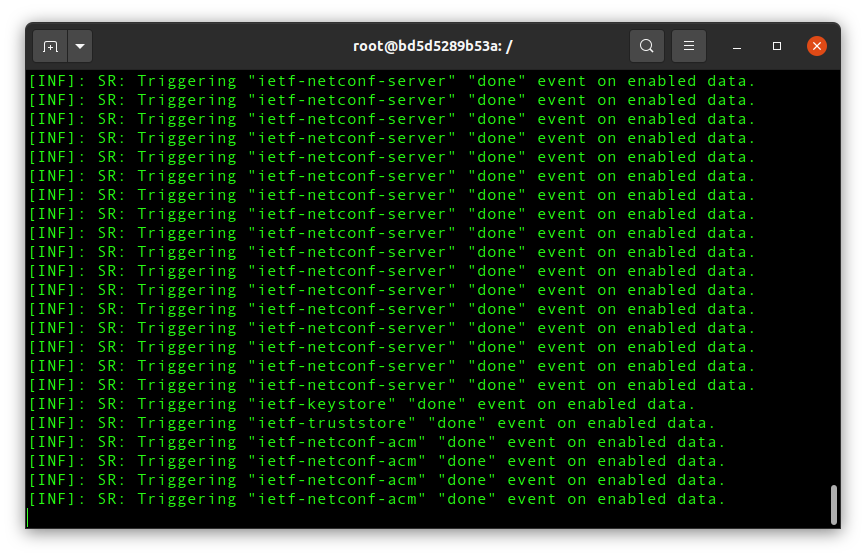
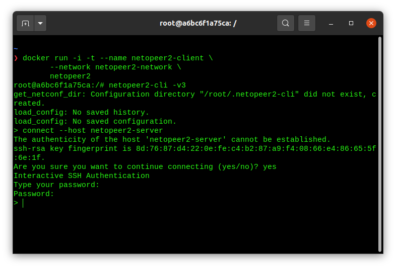

# Netopeer2 Docker setup

## Create a netopeer2 image

[Source](https://github.com/sysrepo-archive/docker-sysrepo-netopeer2/blob/master/Dockerfile)

Remove all stopped containers, dangling images and unused networks:

```
docker system prune
```

Build the `netopeer2` image

```
docker build -t netopeer2 .
```

`Dockerfile`:

```
FROM ubuntu:20.04

COPY ./netopeer2-setup.sh .

RUN chmod +x netopeer2-setup.sh
RUN ./netopeer2-setup.sh
```

`netopeer2-setup.sh` installs all the necessary packages/libraries to run netopeer2

## Setup netopeer2 server-client network (manually)

Create the `netopeer2-network`

```
docker network create netopeer2-network
```

**Terminal 1** (server)

Run `netopeer2-server` container

```
docker run -i -t --name netopeer2-server \
      --network netopeer2-network --network-alias server \
      netopeer2
```

Set password (`netopeer` for example) and start running netopeer2 server

```
root@xxxxxxxxx:/# passwd
root@xxxxxxxxx:/# netopeer2-server -d -v3
```



**Terminal 2** (client)

Run `netopeer2-client` container

```
docker run -i -t --name netopeer2-client \
      --network netopeer2-network --network-alias client \
      netopeer2
```

Start running netopeer2 client

```
root@xxxxxxxxx:/# netopeer2-cli -v3
```

Connect to netopeer2-server using network alias (password: `netopeer`)

```
root@xxxxxxxxx:/# connect --host server
```



Get the running netopeer2 server configuration:

```
get-config --source running
```

## Setup netopeer2 server-client network (Docker compose)