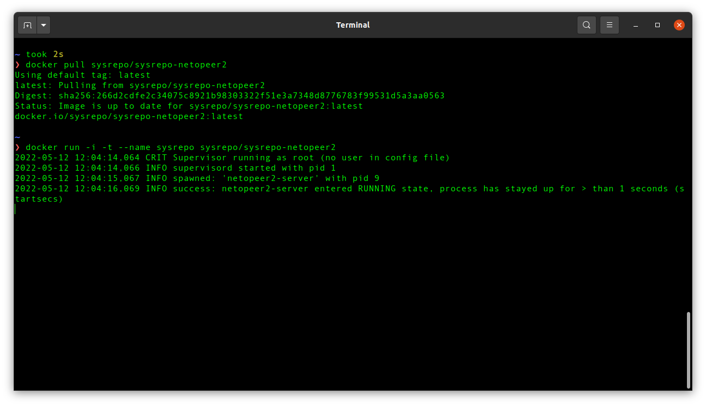
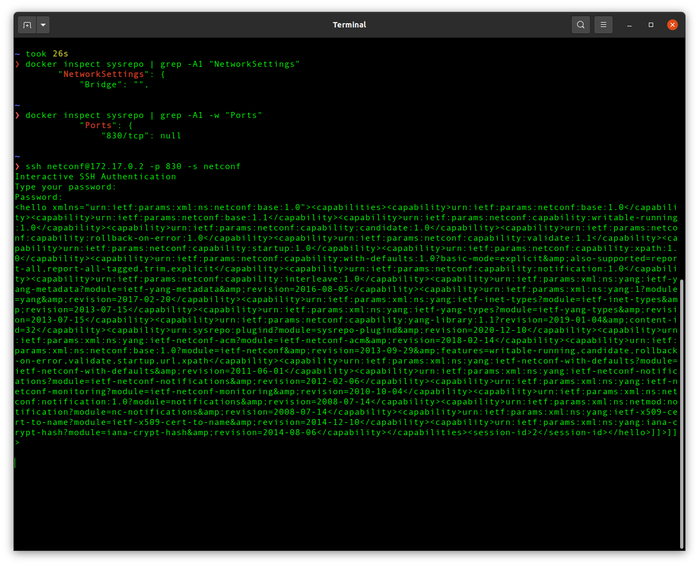
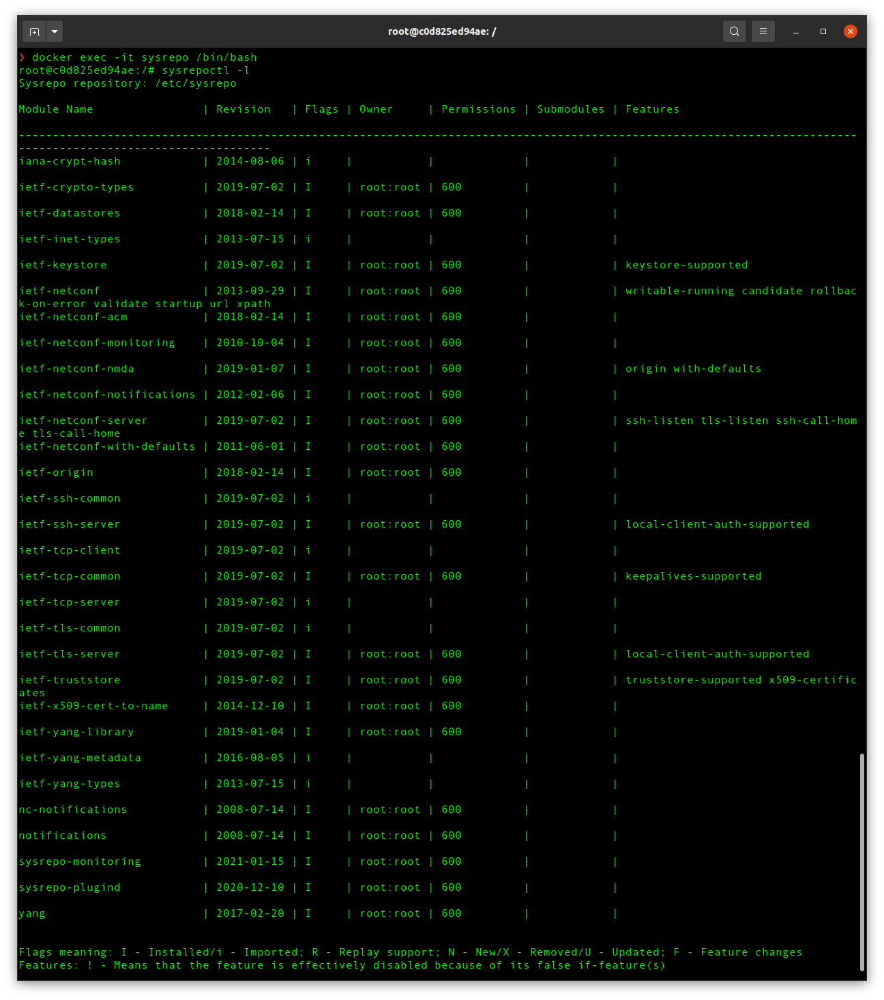

# Docker setup: netopeer2

## NETCONF server

- **terminal 1**: run NETCONF server in `sysrepo` container
  - `docker pull sysrepo/sysrepo-netopeer2`
  - `docker run -i -t --name sysrepo sysrepo/sysrepo-netopeer2`
    - _For interactive processes, you must use `-i -t` together in order to allocate a tty for the container process_ ([reference](https://docs.docker.com/engine/reference/run/#foreground))

  

- **terminal 2**: connect to the NETCONF server via SSH
  - `docker inspect sysrepo | grep -w "IPAddress"`
    - `-w`, `--word`: _Select only those lines containing matches that form whole words_ ([reference](https://linuxcommand.org/lc3_man_pages/grep1.html))
  - `docker inspect sysrepo | grep -A1 -w "Ports"`
    - `-A NUM`: _Print NUM lines of trailing context after matching lines_ ([reference](https://linuxcommand.org/lc3_man_pages/grep1.html))
  - `ssh netconf@172.17.0.2 -p 830 -s netconf`
    - password: `netconf`
    - `-s ctl_path`: _Specifies the location of a control socker for connection sharing_ ([reference](https://linux.die.net/man/1/ssh))

  

- **terminal 3**: access `sysrepoctl` or `sysrepocfg` exec bash in the `sysrepo` container
  - `docker exec -it sysrepo /bin/bash`
  - `sysrepoctl -l`
    - _sysrepoctl is a command-line tool for manipulation of YANG schemes in sysrepo (list currently installed schemas and add, remove or modify them)_ ([reference](https://manpages.debian.org/unstable/sysrepo/sysrepoctl.1.en.html))
  - `sysrepocfg`
    - _sysrepocfg allows to work with configuration in many ways such as importing, exporting, editing and replacing (copying-from a file or datastore) it. It is also possible to send an rpc/action or a notification_ ([reference](https://netopeer.liberouter.org/doc/sysrepo/libyang1/html/sysrepocfg.html))
- **_alternative_ terminal 3**: connect to NETCONF server via [`testconf`](https://hub.docker.com/r/sysrepo/testconf/)
  - `docker run -i -t --link sysrepo --name testconf --rm sysrepo/testconf:latest bash`
    - `--rm`: _By default a container's file system persist even after the container exits. This makes debugging easier (since you can inspect the final state) and you retain all your data by default. But if you are running short-term foreground processes, these container file systems can really pile up. If instead you'd like Docker to automatically clean up the container and remove the file system when the container exits, you can add this flag._ ([reference](https://docs.docker.com/engine/reference/run/#clean-up---rm))
  - `sysrepoctl -l` 
  - `sysrepocfg`

  

### Source

[hub.docker.com/r/sysrepo/sysrepo-netopeer2](https://hub.docker.com/r/sysrepo/sysrepo-netopeer2)